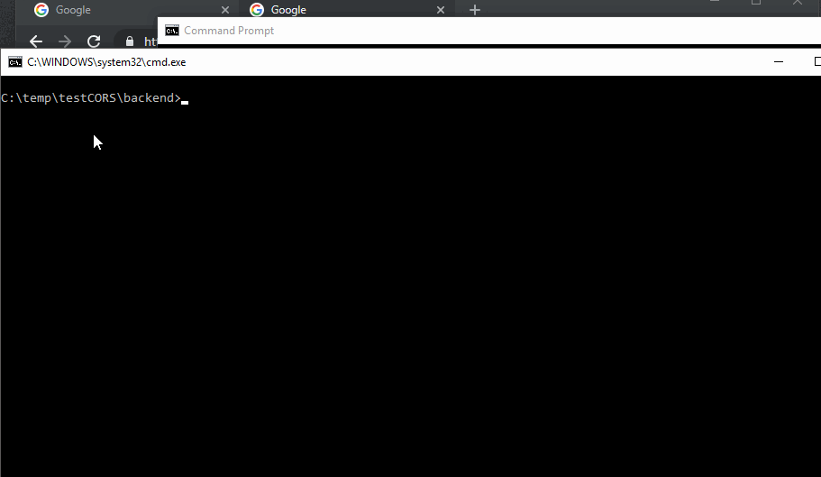

# ERROR: Access to XMLHttpRequest at 'http://localhost:3000/api/products' from origin 'http://localhost:8080' has been blocked by CORS policy: Response to preflight request doesn't pass access control check: It does not have HTTP ok status.

This error hapens when I add a "Authorization" token ou basic at the request header from browser to client, developing with webpack with hotreload etc.  

I can't undestand why.

### Video example:



I add the cors police header at the server, but it doesnt send the header to the server anyway...

file: app.js
```javascript 
//(...)
app.use(function(req, res, next) {
  res.header('Access-Control-Allow-Origin', "*");
  res.header('Access-Control-Allow-Methods', 'GET,PUT,POST,DELETE');
  res.header('Access-Control-Allow-Credentials', 'true');
  res.header("Access-Control-Allow-Headers", "Access-Control-Allow-Headers, access-control-request-headers, Origin, Accept, X-Requested-With, Content-Type, Access-Control-Request-Method, Access-Control-Request-Headers, authorization, Access-Control-Allow-Credentials, X-Auth-Token, X-Accept-Charset,X-Accept");
  //res.header("Access-Control-Allow-Headers", "*");
  
  //res.header("Access-Control-Allow-Headers", "Origin, X-Requested-With, Content-Type, Accept");
  next();
});
//(...)
```

# TEST TO DEMONSTRATE DE PROBLEM TO MAKE A AUTENTICATION WITH AUTORIZATION

## TO INSTALL

```bash

c:\...\testCORS> cd backend
c:\...\testCORS\backend> yarn
# They will install ...
c:\...\testCORS\backend> cd ..
c:\...\testCORS> cd frontend
c:\...\testCORS\frontend> yarn

# Open 2 consoles, to run both
# server
c:\...\testCORS\backend> npm run dev

# client
c:\...\testCORS\frontend> npm run dev

```

## Make the test

- Access `http://localhost:3000` click on `Get data from the same server` and the server will respond correctly;
- Access `http://localhost:8080` click on `Get data from localhost:3000, from vue` and the server will not acess;
- Reading the LOG of the Server Console, you will see:

```
NODE_ENV = development
Express server listening on port 3000
-----------------------------------------------
 ---> From:  http://localhost:8080
 ---> Headers - Exists
 ---> Headers :: Authorization - DOES NOT Exists
-----------------------------------------------
 ---> From:  undefined
 ---> Headers - Exists
 ---> Headers :: Authorization - Exists
```

Both request execute the same code `axios.get('http://localhost:3000/api/products', {headers : { authorization: 'Bearer ${token}' } })` placing the 'authorization', to autenticate the server (in the correct server, with passport, etc...)

BUT:

- The first request, made from the other server (port 8080), there are no `autorization` header.   
- In the second request, made from the same server (port 3000), autorization is NOT present in the header.

So, there is any solution for this problem?

